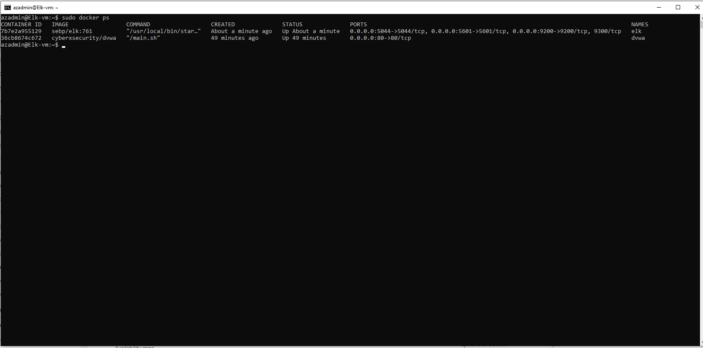

## Automated ELK Stack Deployment

The files in this repository were used to configure the network depicted below.

These files have been tested and used to generate a live ELK deployment on Azure. They can be used to either recreate the entire deployment pictured above. Alternatively, select portions of the YML file may be used to install only certain pieces of it, such as Filebeat.

[filebeat-playbook](Ansible/filebeat_-playbook.yml)

[hosts](Ansible/hosts)

This document contains the following details:
- Description of the Topologu
- Access Policies
- ELK Configuration
  - Beats in Use
  - Machines Being Monitored
- How to Use the Ansible Build

### Description of the Topology

The main purpose of this network is to expose a load-balanced and monitored instance of DVWA, the D*mn Vulnerable Web Application.

Load balancing ensures that the application will be highly Available, in addition to restricting Access to the network.
Load balancers help ensure environment availability through distribution of incoming data to web servers. Jump boxes allow for more easy administration of multiple systems and provide an additional layer between the outside and internal assets.

Integrating an ELK server allows users to easily monitor the vulnerable VMs for changes to the logs and system metrics.

Filbeats watch for log directories or specific log files.
Metricbeat helps you monitor your servers by collecting metrics from the system and services running on the server.

The configuration details of each machine may be found below.

| Name     | Function | IP Address | Operating System |
|----------|----------|------------|------------------|
| Jump Box | Gateway  | 10.0.0.4   | Linux            |
| Web-1    | Server   | 10.0.0.7   | Linux            |
| Web-2    | Server   | 10.0.0.8   | Linux            |
| ELK Serv | Log Serv | 10.2.0.4   | Linux            |

### Access Policies

The machines on the internal network are not exposed to the public Internet. 

Only the jump box provisioner machine can accept connections from the Internet. Access to this machine is only allowed from the following IP addresses:

-Personal IP address

Machines within the network can only be accessed by the Jump Box. The Elk Machine can have access from personal IP address through port 5601.

A summary of the access policies in place can be found in the table below.

| Name     | Publicly Accessible | Allowed IP Addresses |
|----------|---------------------|----------------------|
|Jump Box  |	Yes                |	Personal            |
|Load Balancer|	Yes            	 |  Open                |
|Web 1	   |  No                 |	10.0.0.7            |
|Web 2	   |  No                 |	10.0.0.8            |
|ELK Server|	Yes	               |  Personal            |
### Elk Configuration

Ansible was used to automate configuration of the ELK machine. No configuration was performed manually, which is advantageous because automating configuration with Ansible t can speed up the deployment of a virtual network.

The playbook implements the following tasks:

Install docker.io
Install python-pip
Install docker module pip
Increase virtual memory
Downlaod and launch a docker elk container

The following screenshot displays the result of running `docker ps` after successfully configuring the ELK instance.

### Target Machines & Beats
This ELK server is configured to monitor the following machines:

10.0.0.7
10.0.0.8

We have installed the following Beats on these machines:

FileBeat
Metric Beat

These Beats allow us to collect the following information from each machine:

Filebeat is a log data shipper for local files. Installed as an agent on your servers, Filebeat monitors the log directories or specific log files, tails the files, and forwards them either to Elasticsearch or Logstash for indexing. An examle of such are the logs produced from the MySQL database supporting our application.
Metricbeat collects metrics and statistics on the system. An example of such is cpu usage, which can be used to monitor the system health.

### Using the Playbook
In order to use the playbook, you will need to have an Ansible control node already configured. Assuming you have such a control node provisioned: 

SSH into the control node and follow the steps below:

Copy the yaml file to the host VM.
Update the yaml file to include...
Run the playbook, and navigate to host VM to check that the installation worked as expected.

Answer the following questions to fill in the blanks:

Which file is the playbook? The yaml(.yml) file is the playbook.
Which file do you update to make Ansible run the playbook on a specific machine? You must update the hosts file.
How do I specify which machine to install the ELK server on versus which to install Filebeat on? In the heading of the yaml file next to host, specifify which machine you want to perform the install using the category you listed the machine on in the hosts file.
Which URL do you navigate to in order to check that the ELK server is running? http://20.97.227.148:5601
